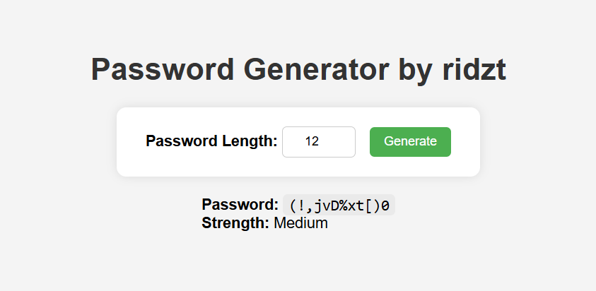

# Password Generator with Flask

A simple password generator and strength checker built using Python Flask.

## Features

- Generate random passwords with optional special characters.
- Check password strength (Weak, Medium, Strong).
- View password history with timestamps (saved locally).
- Clean web dashboard using HTML + CSS.

## Overview

<!--  -->

